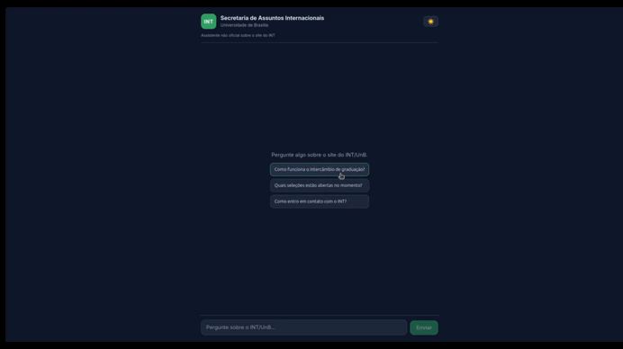

# Chatbot RAG — INT/UnB

Assistente conversacional que responde perguntas sobre o site institucional do **INT**
(Secretaria de Assuntos Internacionais da Universidade de Brasília) — mobilidade acadêmica,
PEC-G, cotutela, dupla diplomação, editais e seleções — usando **RAG** (Retrieval-Augmented
Generation) sobre o conteúdo real do `int.unb.br`, com **atualização automática** via GitHub Actions.

> ⚠️ **Disclaimer**: projeto pessoal/acadêmico de portfólio. **Não é** um canal oficial de
> informação do INT/UnB e não tem qualquer afiliação institucional.

---

## Visão geral

O bot só responde com base no que foi raspado do site do INT: ele **recupera** os trechos mais
relevantes da base e **gera** a resposta a partir deles. Isso traz duas propriedades importantes:

- **Não alucina**: quando a informação não está na base, ele admite — em vez de inventar prazos,
  valores ou requisitos. Perguntas fora do escopo (ex.: cardápio do RU, vestibular) são recusadas
  com cordialidade.
- **Fica atualizado**: o conteúdo de seleções abertas/encerradas muda com frequência, então um
  workflow re-raspa o site semanalmente e atualiza a base — sem re-treinar nenhum modelo.

**Por que RAG e não fine-tuning?** O conteúdo institucional muda o tempo todo; RAG permite atualizar
a base continuamente sem re-treinar nada. (Detalhes e trade-offs em [`backend/README.md`](backend/README.md).)

## Demonstração



<!-- 👆 Substitua `docs/demo.gif` pelo seu GIF (crie a pasta `docs/` e adicione o arquivo).
     Sugestão de roteiro para gravar: (1) "Quais seleções estão abertas no INT?" — mostra a lista
     atualizada; (2) "Qual a diferença entre cotutela e dupla diplomação?" — resposta multi-fonte;
     (3) "Qual o cardápio do RU hoje?" — o bot recusa educadamente (fora de escopo). -->

**Exemplos do que ele faz bem:**

| Pergunta | Comportamento |
|----------|---------------|
| "Como funciona o intercâmbio de graduação?" | Responde com base no FAQ, sem inventar detalhes |
| "Quais seleções estão abertas atualmente?" | Lista as seleções **atuais** (validando o re-scraping) |
| "Qual a diferença entre cotutela e dupla diplomação?" | Sintetiza informação de páginas diferentes |
| "Qual a capital da França?" | Recusa: fora do escopo do INT |

## Funcionalidades

- 🔎 **RAG sobre o site real do INT** — scraping respeitando o escopo (`int.unb.br/br/*`), limpeza,
  chunking e busca vetorial.
- 🗣️ **Responde só em português** e **só com base na fonte** (sem alucinar; recusa fora de escopo).
- 🔄 **Atualização automática** do conteúdo via GitHub Actions (re-scraping semanal).
- 💬 **Interface de chat** com markdown, tema claro/escuro e citação das fontes sob cada resposta.
- ✅ **Conjunto de avaliação** com 20 perguntas em 5 categorias (ver [Avaliação](#avaliação)).

## Arquitetura

```
Site INT (int.unb.br/*) ──► Scraping (HTML) ──► Limpeza ──► Chunking ──►
Embeddings (Gemini) ──► Vector Store (ChromaDB)
                                    │
              pergunta ──► Retrieval (top-k) ──► Prompt + LLM (Gemini) ──► Resposta + fontes
```

## Stack

Monorepo com duas partes:

| Pasta | O que é | Stack |
|-------|---------|-------|
| [`backend/`](backend/) | Scraper + pipeline RAG + API | Python · FastAPI · ChromaDB · Google Gemini |
| [`frontend/`](frontend/) | Interface de chat | Vite · React |

## Instalação e execução

**Pré-requisitos:** Python 3.12+, Node 18+, e uma chave da API do Google Gemini
(gratuita, em [aistudio.google.com/app/apikey](https://aistudio.google.com/app/apikey)).

### 1. Backend (API + pipeline RAG)

```bash
cd backend
python3 -m venv venv && source venv/bin/activate
pip install -r requirements.txt

cp .env.example .env          # preencha GEMINI_API_KEY

python -m scripts.run_pipeline    # popula o vector store (scrape → chunk → embed → index)
uvicorn src.api.main:app --reload # API em http://localhost:8000/docs
```

> **Sobre o `run_pipeline`:** ele coleta o site uma vez (cache em `data/raw/`) e indexa em lotes.
> No tier gratuito do Gemini, se a cota diária acabar ele **para de forma limpa e retoma de onde
> parou** na próxima execução. O `chroma_db/` já vem populado no repositório, então para só subir a
> API você pode pular o `run_pipeline`.

### 2. Frontend (interface de chat)

Em outro terminal:

```bash
cd frontend
npm install
cp .env.example .env          # ajuste VITE_API_URL se o backend não estiver em :8000
npm run dev                   # http://localhost:5173
```

## Avaliação

O sistema é avaliado por um conjunto de **20 perguntas em 5 categorias** (diretas, multi-fonte,
fora de escopo, armadilhas e conteúdo dinâmico), incluindo testes de discriminação fina
(ECTS × GPA, ELAP graduação × pós, revalidação × transferência).

**Última rodada: 20 ✅ · 0 ❌** — sem alucinações. Cada resposta é conferida manualmente contra o
HTML coletado. Registro completo e metodologia em
[`backend/tests/eval/resultados.md`](backend/tests/eval/resultados.md) e na seção *Resultados* do
[`backend/README.md`](backend/README.md).

## Atualização automática (re-scraping)

[`.github/workflows/rescrape.yml`](.github/workflows/rescrape.yml) roda o pipeline semanalmente
(e sob demanda pela aba *Actions*), re-raspando o site e **comitando o `chroma_db/` atualizado** de
volta no repositório. Requer o secret **`GEMINI_API_KEY`** configurado em
*Settings → Secrets and variables → Actions*.

## Estrutura do repositório

```
.
├── backend/                       # scraper + pipeline RAG + API (ver backend/README.md)
│   ├── src/                       # scraper, ingestion, rag, api
│   ├── scripts/                   # run_pipeline, run_eval, analyze_crawl
│   ├── tests/                     # testes + conjunto de avaliação (tests/eval/)
│   └── chroma_db/                 # vector store persistido (comitado)
├── frontend/                      # interface de chat (ver frontend/README.md)
├── .github/workflows/rescrape.yml # re-scraping periódico
└── CONTEXTO_PROJETO.md            # decisões de projeto e seus porquês
```

## Limitações conhecidas

- **Tier gratuito do Gemini**: sujeito a limites por minuto e por dia; a ingestão trata isso com
  retry, lotes e *checkpoint* (retoma no dia seguinte).
- **Editais em PDF escaneado**: os editais do INT são imagens sem camada de texto, então não são
  lidos por extração de texto — a base usa o HTML de cada edital (que já traz o essencial). OCR fica
  como evolução futura.
- O `chroma_db/` é comitado no repositório.

Mais detalhes em [`backend/README.md`](backend/README.md).
